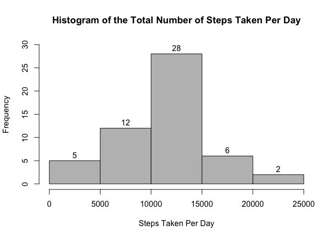
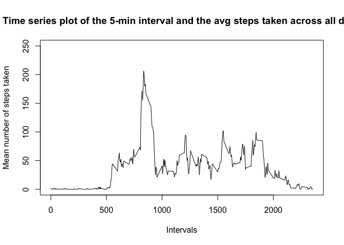
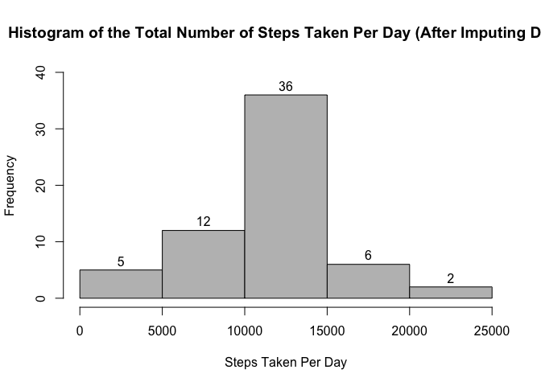
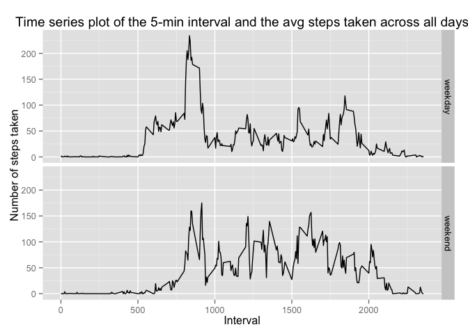

# Reproducible Research: Peer Assessment 1
## Loading libraries, loading data and preprocessing the data. 

```r
if("plyr" %in% rownames(installed.packages()) == FALSE)
      {
            install.packages("plyr")
      }
      
      if("ggplot2" %in% rownames(installed.packages()) == FALSE)
      {
            install.packages("ggplot2")
      }

library(plyr)
library(ggplot2)
```

```
## Warning: package 'ggplot2' was built under R version 3.1.3
```

```r
tbl <- read.csv("activity.csv", header = TRUE)
```
####A sample of the loaded data is shown.

```r
head(tbl)
```

```
##   steps       date interval
## 1    NA 2012-10-01        0
## 2    NA 2012-10-01        5
## 3    NA 2012-10-01       10
## 4    NA 2012-10-01       15
## 5    NA 2012-10-01       20
## 6    NA 2012-10-01       25
```

## What is the mean total number of steps taken per day?
#### Calculate the total mean and median number of steps per day and report it. Then, make a histogram of the total number of steps taken each day.
#### NOTE: Missing values are ignored.  

```r
res=ddply(tbl, .(date), summarize, SUM=sum(steps), MEAN=mean(steps), MEDIAN=median(steps))

hist(res$SUM, 
      main="Histogram of the Total Number of Steps Taken Per Day",
      xlab="Steps Taken Per Day",
      col="gray",
      labels=TRUE,
      ylim =c(0, 30)
     )
```

 

```r
res
```

```
##          date   SUM       MEAN MEDIAN
## 1  2012-10-01    NA         NA     NA
## 2  2012-10-02   126  0.4375000      0
## 3  2012-10-03 11352 39.4166667      0
## 4  2012-10-04 12116 42.0694444      0
## 5  2012-10-05 13294 46.1597222      0
## 6  2012-10-06 15420 53.5416667      0
## 7  2012-10-07 11015 38.2465278      0
## 8  2012-10-08    NA         NA     NA
## 9  2012-10-09 12811 44.4826389      0
## 10 2012-10-10  9900 34.3750000      0
## 11 2012-10-11 10304 35.7777778      0
## 12 2012-10-12 17382 60.3541667      0
## 13 2012-10-13 12426 43.1458333      0
## 14 2012-10-14 15098 52.4236111      0
## 15 2012-10-15 10139 35.2048611      0
## 16 2012-10-16 15084 52.3750000      0
## 17 2012-10-17 13452 46.7083333      0
## 18 2012-10-18 10056 34.9166667      0
## 19 2012-10-19 11829 41.0729167      0
## 20 2012-10-20 10395 36.0937500      0
## 21 2012-10-21  8821 30.6284722      0
## 22 2012-10-22 13460 46.7361111      0
## 23 2012-10-23  8918 30.9652778      0
## 24 2012-10-24  8355 29.0104167      0
## 25 2012-10-25  2492  8.6527778      0
## 26 2012-10-26  6778 23.5347222      0
## 27 2012-10-27 10119 35.1354167      0
## 28 2012-10-28 11458 39.7847222      0
## 29 2012-10-29  5018 17.4236111      0
## 30 2012-10-30  9819 34.0937500      0
## 31 2012-10-31 15414 53.5208333      0
## 32 2012-11-01    NA         NA     NA
## 33 2012-11-02 10600 36.8055556      0
## 34 2012-11-03 10571 36.7048611      0
## 35 2012-11-04    NA         NA     NA
## 36 2012-11-05 10439 36.2465278      0
## 37 2012-11-06  8334 28.9375000      0
## 38 2012-11-07 12883 44.7326389      0
## 39 2012-11-08  3219 11.1770833      0
## 40 2012-11-09    NA         NA     NA
## 41 2012-11-10    NA         NA     NA
## 42 2012-11-11 12608 43.7777778      0
## 43 2012-11-12 10765 37.3784722      0
## 44 2012-11-13  7336 25.4722222      0
## 45 2012-11-14    NA         NA     NA
## 46 2012-11-15    41  0.1423611      0
## 47 2012-11-16  5441 18.8923611      0
## 48 2012-11-17 14339 49.7881944      0
## 49 2012-11-18 15110 52.4652778      0
## 50 2012-11-19  8841 30.6979167      0
## 51 2012-11-20  4472 15.5277778      0
## 52 2012-11-21 12787 44.3993056      0
## 53 2012-11-22 20427 70.9270833      0
## 54 2012-11-23 21194 73.5902778      0
## 55 2012-11-24 14478 50.2708333      0
## 56 2012-11-25 11834 41.0902778      0
## 57 2012-11-26 11162 38.7569444      0
## 58 2012-11-27 13646 47.3819444      0
## 59 2012-11-28 10183 35.3576389      0
## 60 2012-11-29  7047 24.4687500      0
## 61 2012-11-30    NA         NA     NA
```

## What is the average daily activity pattern?
#### Make a time series plot (type="l") of the 5 minute interval (x-axis) and the average number of steps taken, averaged across all days (y-axis).

```r
res2=ddply(tbl, c("interval"), summarize, MEAN=mean(steps, na.rm=TRUE))
plot(res2$interval, res2$MEAN, 
      type="l",
      main="Time series plot of the 5-min interval and the avg steps taken across all days",
      xlab="Intervals",
      ylab="Mean number of steps taken",
      ylim =c(0, 250)
     )
```

 

#### Which 5 minute interval, on average across all days, contains the max number of steps?

```r
res3 <- res2[order(res2$MEAN, decreasing=TRUE), ]
res3[1, ]
```

```
##     interval     MEAN
## 104      835 206.1698
```

## Imputing missing values
#### Calculate & report the total of missing values in the dataset. 

```r
num_of_missing_values <- sum(is.na(tbl$steps))
num_of_missing_values
```

```
## [1] 2304
```

#### Use the mean of each interval to fill in the missing data in the raw data file.

```r
tbl2 <- merge(x=tbl, y=res2, by="interval", all.x=TRUE)
tbl2$new_steps <- ifelse(is.na(tbl2$steps), tbl2$MEAN, tbl2$steps)
```

#### A sample of the new dataset is shown, where the "new_steps" column contains the imputed values. 

```r
head(tbl2)
```

```
##   interval steps       date     MEAN new_steps
## 1        0    NA 2012-10-01 1.716981  1.716981
## 2        0     0 2012-11-23 1.716981  0.000000
## 3        0     0 2012-10-28 1.716981  0.000000
## 4        0     0 2012-11-06 1.716981  0.000000
## 5        0     0 2012-11-24 1.716981  0.000000
## 6        0     0 2012-11-15 1.716981  0.000000
```

#### Using the new dataset, calculate the total number of steps taken each day & calculate and report the mean and median total number of steps taken per day. Then make a histogram of the total number of steps taken each day.

```r
res3=ddply(tbl2, .(date), summarize, SUM=sum(new_steps), MEAN=mean(new_steps), MEDIAN=median(new_steps))

hist(res3$SUM, 
      main="Histogram of the Total Number of Steps Taken Per Day (After Imputing Data",
      xlab="Steps Taken Per Day",
      col="gray",
      labels=TRUE,
      ylim =c(0, 40)
     )
```

 

```r
res3
```

```
##          date      SUM       MEAN   MEDIAN
## 1  2012-10-01 10766.19 37.3825996 34.11321
## 2  2012-10-02   126.00  0.4375000  0.00000
## 3  2012-10-03 11352.00 39.4166667  0.00000
## 4  2012-10-04 12116.00 42.0694444  0.00000
## 5  2012-10-05 13294.00 46.1597222  0.00000
## 6  2012-10-06 15420.00 53.5416667  0.00000
## 7  2012-10-07 11015.00 38.2465278  0.00000
## 8  2012-10-08 10766.19 37.3825996 34.11321
## 9  2012-10-09 12811.00 44.4826389  0.00000
## 10 2012-10-10  9900.00 34.3750000  0.00000
## 11 2012-10-11 10304.00 35.7777778  0.00000
## 12 2012-10-12 17382.00 60.3541667  0.00000
## 13 2012-10-13 12426.00 43.1458333  0.00000
## 14 2012-10-14 15098.00 52.4236111  0.00000
## 15 2012-10-15 10139.00 35.2048611  0.00000
## 16 2012-10-16 15084.00 52.3750000  0.00000
## 17 2012-10-17 13452.00 46.7083333  0.00000
## 18 2012-10-18 10056.00 34.9166667  0.00000
## 19 2012-10-19 11829.00 41.0729167  0.00000
## 20 2012-10-20 10395.00 36.0937500  0.00000
## 21 2012-10-21  8821.00 30.6284722  0.00000
## 22 2012-10-22 13460.00 46.7361111  0.00000
## 23 2012-10-23  8918.00 30.9652778  0.00000
## 24 2012-10-24  8355.00 29.0104167  0.00000
## 25 2012-10-25  2492.00  8.6527778  0.00000
## 26 2012-10-26  6778.00 23.5347222  0.00000
## 27 2012-10-27 10119.00 35.1354167  0.00000
## 28 2012-10-28 11458.00 39.7847222  0.00000
## 29 2012-10-29  5018.00 17.4236111  0.00000
## 30 2012-10-30  9819.00 34.0937500  0.00000
## 31 2012-10-31 15414.00 53.5208333  0.00000
## 32 2012-11-01 10766.19 37.3825996 34.11321
## 33 2012-11-02 10600.00 36.8055556  0.00000
## 34 2012-11-03 10571.00 36.7048611  0.00000
## 35 2012-11-04 10766.19 37.3825996 34.11321
## 36 2012-11-05 10439.00 36.2465278  0.00000
## 37 2012-11-06  8334.00 28.9375000  0.00000
## 38 2012-11-07 12883.00 44.7326389  0.00000
## 39 2012-11-08  3219.00 11.1770833  0.00000
## 40 2012-11-09 10766.19 37.3825996 34.11321
## 41 2012-11-10 10766.19 37.3825996 34.11321
## 42 2012-11-11 12608.00 43.7777778  0.00000
## 43 2012-11-12 10765.00 37.3784722  0.00000
## 44 2012-11-13  7336.00 25.4722222  0.00000
## 45 2012-11-14 10766.19 37.3825996 34.11321
## 46 2012-11-15    41.00  0.1423611  0.00000
## 47 2012-11-16  5441.00 18.8923611  0.00000
## 48 2012-11-17 14339.00 49.7881944  0.00000
## 49 2012-11-18 15110.00 52.4652778  0.00000
## 50 2012-11-19  8841.00 30.6979167  0.00000
## 51 2012-11-20  4472.00 15.5277778  0.00000
## 52 2012-11-21 12787.00 44.3993056  0.00000
## 53 2012-11-22 20427.00 70.9270833  0.00000
## 54 2012-11-23 21194.00 73.5902778  0.00000
## 55 2012-11-24 14478.00 50.2708333  0.00000
## 56 2012-11-25 11834.00 41.0902778  0.00000
## 57 2012-11-26 11162.00 38.7569444  0.00000
## 58 2012-11-27 13646.00 47.3819444  0.00000
## 59 2012-11-28 10183.00 35.3576389  0.00000
## 60 2012-11-29  7047.00 24.4687500  0.00000
## 61 2012-11-30 10766.19 37.3825996 34.11321
```

#### Do these values differ from the estimates from the 1st part of the assignment? What is the impact of imputing missing data on the estimates of the total daily number of steps. 
Yes, there is a small difference. The frequency of steps in the 10-15K step range has increased from 28 to 36.

## Are there differences in activity patterns between weekdays and weekends?
#### Create a new factor variable with 2 levels (weekday and weekend). 

```r
tbl$day <- weekdays(as.Date(tbl$date))
tbl$daytype <- ifelse(tbl$day %in% c("Saturday", "Sunday"), "weekend", "weekday")
```

#### A sample is shown below.

```r
head(tbl)
```

```
##   steps       date interval    day daytype
## 1    NA 2012-10-01        0 Monday weekday
## 2    NA 2012-10-01        5 Monday weekday
## 3    NA 2012-10-01       10 Monday weekday
## 4    NA 2012-10-01       15 Monday weekday
## 5    NA 2012-10-01       20 Monday weekday
## 6    NA 2012-10-01       25 Monday weekday
```

#### Make a panel plot containing a time series plot (type="l") of the 5 minute interval (x-axis) and the average number of steps taken, averaged across all weekdays/weekend days (y-axis).

```r
res4=ddply(tbl, c("interval","daytype"), summarize, MEAN=mean(steps, na.rm=TRUE))

xlabel <- "Interval"
ylabel <- "Number of steps taken"
maintitle <- "Time series plot of the 5-min interval and the avg steps taken across all days"
g <- ggplot(res4, aes(x=interval, y=MEAN)) + facet_grid(daytype~.) + xlab(xlabel) + ylab(ylabel) + ggtitle(maintitle)
print(g + geom_line())
```

 

```r
res4
```

```
##     interval daytype        MEAN
## 1          0 weekday   2.3333333
## 2          0 weekend   0.0000000
## 3          5 weekday   0.4615385
## 4          5 weekend   0.0000000
## 5         10 weekday   0.1794872
## 6         10 weekend   0.0000000
## 7         15 weekday   0.2051282
## 8         15 weekend   0.0000000
## 9         20 weekday   0.1025641
## 10        20 weekend   0.0000000
## 11        25 weekday   1.5128205
## 12        25 weekend   3.7142857
## 13        30 weekday   0.7179487
## 14        30 weekend   0.0000000
## 15        35 weekday   1.1794872
## 16        35 weekend   0.0000000
## 17        40 weekday   0.0000000
## 18        40 weekend   0.0000000
## 19        45 weekday   1.8461538
## 20        45 weekend   0.4285714
## 21        50 weekday   0.4102564
## 22        50 weekend   0.0000000
## 23        55 weekday   0.0000000
## 24        55 weekend   0.5000000
## 25       100 weekday   0.4358974
## 26       100 weekend   0.0000000
## 27       105 weekday   0.0000000
## 28       105 weekend   2.5714286
## 29       110 weekday   0.2051282
## 30       110 weekend   0.0000000
## 31       115 weekday   0.4615385
## 32       115 weekend   0.0000000
## 33       120 weekday   0.0000000
## 34       120 weekend   0.0000000
## 35       125 weekday   1.5128205
## 36       125 weekend   0.0000000
## 37       130 weekday   2.2820513
## 38       130 weekend   0.5714286
## 39       135 weekday   0.0000000
## 40       135 weekend   0.6428571
## 41       140 weekday   0.2307692
## 42       140 weekend   0.0000000
## 43       145 weekday   0.2307692
## 44       145 weekend   0.7857143
## 45       150 weekday   0.3589744
## 46       150 weekend   0.0000000
## 47       155 weekday   0.0000000
## 48       155 weekend   0.0000000
## 49       200 weekday   0.0000000
## 50       200 weekend   0.0000000
## 51       205 weekday   0.0000000
## 52       205 weekend   0.0000000
## 53       210 weekday   1.4358974
## 54       210 weekend   0.2857143
## 55       215 weekday   0.0000000
## 56       215 weekend   0.0000000
## 57       220 weekday   0.0000000
## 58       220 weekend   0.0000000
## 59       225 weekday   0.1794872
## 60       225 weekend   0.0000000
## 61       230 weekday   0.0000000
## 62       230 weekend   0.0000000
## 63       235 weekday   0.3076923
## 64       235 weekend   0.0000000
## 65       240 weekday   0.0000000
## 66       240 weekend   0.0000000
## 67       245 weekday   0.0000000
## 68       245 weekend   0.0000000
## 69       250 weekday   2.1025641
## 70       250 weekend   0.0000000
## 71       255 weekday   1.2820513
## 72       255 weekend   0.0000000
## 73       300 weekday   0.0000000
## 74       300 weekend   0.0000000
## 75       305 weekday   0.0000000
## 76       305 weekend   0.0000000
## 77       310 weekday   0.0000000
## 78       310 weekend   0.0000000
## 79       315 weekday   0.0000000
## 80       315 weekend   0.0000000
## 81       320 weekday   0.0000000
## 82       320 weekend   0.7857143
## 83       325 weekday   0.8461538
## 84       325 weekend   0.0000000
## 85       330 weekday   1.1794872
## 86       330 weekend   2.8571429
## 87       335 weekday   0.5128205
## 88       335 weekend   0.7857143
## 89       340 weekday   0.4102564
## 90       340 weekend   0.7142857
## 91       345 weekday   0.1025641
## 92       345 weekend   0.0000000
## 93       350 weekday   0.0000000
## 94       350 weekend   0.0000000
## 95       355 weekday   0.0000000
## 96       355 weekend   0.0000000
## 97       400 weekday   0.1282051
## 98       400 weekend   4.1428571
## 99       405 weekday   1.2820513
## 100      405 weekend   0.0000000
## 101      410 weekday   2.1794872
## 102      410 weekend   3.6428571
## 103      415 weekday   0.0000000
## 104      415 weekend   0.0000000
## 105      420 weekday   0.4615385
## 106      420 weekend   0.0000000
## 107      425 weekday   0.0000000
## 108      425 weekend   1.3571429
## 109      430 weekday   3.2564103
## 110      430 weekend   6.5000000
## 111      435 weekday   0.1538462
## 112      435 weekend   2.0714286
## 113      440 weekday   3.8205128
## 114      440 weekend   2.5714286
## 115      445 weekday   0.8974359
## 116      445 weekend   0.6428571
## 117      450 weekday   2.2307692
## 118      450 weekend   5.5714286
## 119      455 weekday   0.6666667
## 120      455 weekend   2.3571429
## 121      500 weekday   0.0000000
## 122      500 weekend   0.0000000
## 123      505 weekday   2.1282051
## 124      505 weekend   0.0000000
## 125      510 weekday   4.0769231
## 126      510 weekend   0.0000000
## 127      515 weekday   2.1794872
## 128      515 weekend   2.4285714
## 129      520 weekday   4.3589744
## 130      520 weekend   0.4285714
## 131      525 weekday   2.6666667
## 132      525 weekend   3.7857143
## 133      530 weekday   2.8461538
## 134      530 weekend   0.0000000
## 135      535 weekday   8.2307692
## 136      535 weekend   0.0000000
## 137      540 weekday  21.0769231
## 138      540 weekend   1.9285714
## 139      545 weekday  24.4615385
## 140      545 weekend   1.2857143
## 141      550 weekday  52.0256410
## 142      550 weekend   4.4285714
## 143      555 weekday  58.0769231
## 144      555 weekend   6.6428571
## 145      600 weekday  42.7948718
## 146      600 weekend   0.0000000
## 147      605 weekday  66.9487179
## 148      605 weekend   0.0000000
## 149      610 weekday  72.5897436
## 150      610 weekend   1.3571429
## 151      615 weekday  79.2564103
## 152      615 weekend  19.4285714
## 153      620 weekday  66.0769231
## 154      620 weekend   5.0714286
## 155      625 weekday  62.0256410
## 156      625 weekend   5.4285714
## 157      630 weekday  68.6410256
## 158      630 weekend   6.2142857
## 159      635 weekday  49.3076923
## 160      635 weekend  11.5714286
## 161      640 weekday  57.4615385
## 162      640 weekend   6.5714286
## 163      645 weekday  56.5128205
## 164      645 weekend   9.7857143
## 165      650 weekday  48.5384615
## 166      650 weekend   6.2142857
## 167      655 weekday  62.1794872
## 168      655 weekend  12.4285714
## 169      700 weekday  51.6410256
## 170      700 weekend  22.0000000
## 171      705 weekday  51.8205128
## 172      705 weekend  23.6428571
## 173      710 weekday  63.7948718
## 174      710 weekend  13.5000000
## 175      715 weekday  71.6153846
## 176      715 weekend   6.8571429
## 177      720 weekday  65.1282051
## 178      720 weekend   7.5714286
## 179      725 weekday  60.3589744
## 180      725 weekend  24.8571429
## 181      730 weekday  67.8461538
## 182      730 weekend  21.7857143
## 183      735 weekday  55.8974359
## 184      735 weekend  12.0714286
## 185      740 weekday  64.3333333
## 186      740 weekend  18.6428571
## 187      745 weekday  85.5128205
## 188      745 weekend  25.0714286
## 189      750 weekday  69.2564103
## 190      750 weekend  26.0714286
## 191      755 weekday  68.1794872
## 192      755 weekend  22.6428571
## 193      800 weekday  84.1538462
## 194      800 weekend  43.3571429
## 195      805 weekday  72.5384615
## 196      805 weekend  56.1428571
## 197      810 weekday 146.2564103
## 198      810 weekend  82.5714286
## 199      815 weekday 185.7435897
## 200      815 weekend  78.9285714
## 201      820 weekday 205.1025641
## 202      820 weekend  76.5714286
## 203      825 weekday 187.9487179
## 204      825 weekend  64.7142857
## 205      830 weekday 202.2051282
## 206      830 weekend 107.9285714
## 207      835 weekday 234.1025641
## 208      835 weekend 128.3571429
## 209      840 weekday 222.4358974
## 210      840 weekend 122.0714286
## 211      845 weekday 186.5897436
## 212      845 weekend 160.0000000
## 213      850 weekday 192.4358974
## 214      850 weekend 158.2142857
## 215      855 weekday 178.6410256
## 216      855 weekend 134.6428571
## 217      900 weekday 171.3846154
## 218      900 weekend  65.6428571
## 219      905 weekday 126.0512821
## 220      905 weekend 118.4285714
## 221      910 weekday  91.6153846
## 222      910 weekend 157.8571429
## 223      915 weekday  84.1025641
## 224      915 weekend 175.0000000
## 225      920 weekday 103.5128205
## 226      920 weekend 104.2857143
## 227      925 weekday  91.9230769
## 228      925 weekend 107.2142857
## 229      930 weekday  57.3333333
## 230      930 weekend  90.9285714
## 231      935 weekday  34.4102564
## 232      935 weekend  75.3571429
## 233      940 weekday  27.8717949
## 234      940 weekend  16.2142857
## 235      945 weekday  41.1794872
## 236      945 weekend  32.0000000
## 237      950 weekday  39.7692308
## 238      950 weekend  21.6428571
## 239      955 weekday  17.1025641
## 240      955 weekend  32.0714286
## 241     1000 weekday  37.4615385
## 242     1000 weekend  49.2142857
## 243     1005 weekday  16.8717949
## 244     1005 weekend  55.1428571
## 245     1010 weekday  38.5641026
## 246     1010 weekend  53.1428571
## 247     1015 weekday  47.0769231
## 248     1015 weekend  68.2142857
## 249     1020 weekday  29.0256410
## 250     1020 weekend  66.5000000
## 251     1025 weekday  32.7435897
## 252     1025 weekend 101.0714286
## 253     1030 weekday  31.4102564
## 254     1030 weekend  80.1428571
## 255     1035 weekday  22.2307692
## 256     1035 weekend  79.7142857
## 257     1040 weekday  21.7948718
## 258     1040 weekend  70.6428571
## 259     1045 weekday  25.5384615
## 260     1045 weekend  36.1428571
## 261     1050 weekday  21.5641026
## 262     1050 weekend  34.9285714
## 263     1055 weekday  21.9230769
## 264     1055 weekend  59.8571429
## 265     1100 weekday  20.2051282
## 266     1100 weekend  62.4285714
## 267     1105 weekday  24.3846154
## 268     1105 weekend  44.4285714
## 269     1110 weekday  10.2051282
## 270     1110 weekend  52.2857143
## 271     1115 weekday  14.8461538
## 272     1115 weekend  55.3571429
## 273     1120 weekday  23.5384615
## 274     1120 weekend  41.8571429
## 275     1125 weekday  23.3076923
## 276     1125 weekend  35.2857143
## 277     1130 weekday  32.6666667
## 278     1130 weekend  35.5714286
## 279     1135 weekday  50.2307692
## 280     1135 weekend  49.2857143
## 281     1140 weekday  44.9487179
## 282     1140 weekend  33.9285714
## 283     1145 weekday  48.4358974
## 284     1145 weekend  33.9285714
## 285     1150 weekday  50.7435897
## 286     1150 weekend  32.9285714
## 287     1155 weekday  55.6666667
## 288     1155 weekend  69.0000000
## 289     1200 weekday  54.4615385
## 290     1200 weekend  90.0714286
## 291     1205 weekday  70.5641026
## 292     1205 weekend 135.4285714
## 293     1210 weekday  81.9230769
## 294     1210 weekend 130.8571429
## 295     1215 weekday  72.5897436
## 296     1215 weekend 149.0000000
## 297     1220 weekday  46.4615385
## 298     1220 weekend 110.5714286
## 299     1225 weekday  46.3076923
## 300     1225 weekend  60.9285714
## 301     1230 weekday  63.8205128
## 302     1230 weekend  28.4285714
## 303     1235 weekday  30.4871795
## 304     1235 weekend  37.7857143
## 305     1240 weekday  21.2820513
## 306     1240 weekend  41.1428571
## 307     1245 weekday  28.0256410
## 308     1245 weekend  64.7857143
## 309     1250 weekday  30.8974359
## 310     1250 weekend  84.5000000
## 311     1255 weekday  54.9487179
## 312     1255 weekend 101.6428571
## 313     1300 weekday  21.8717949
## 314     1300 weekend  99.3571429
## 315     1305 weekday  23.5641026
## 316     1305 weekend  85.3571429
## 317     1310 weekday  21.6923077
## 318     1310 weekend 103.3571429
## 319     1315 weekday  11.7435897
## 320     1315 weekend 122.4285714
## 321     1320 weekday  34.0000000
## 322     1320 weekend  80.3571429
## 323     1325 weekday  43.0769231
## 324     1325 weekend  93.6428571
## 325     1330 weekday  30.0769231
## 326     1330 weekend  78.0714286
## 327     1335 weekday  23.0256410
## 328     1335 weekend  31.0000000
## 329     1340 weekday  22.9743590
## 330     1340 weekend  87.2857143
## 331     1345 weekday  38.1282051
## 332     1345 weekend  96.5000000
## 333     1350 weekday  22.2307692
## 334     1350 weekend 117.2142857
## 335     1355 weekday  32.5641026
## 336     1355 weekend 139.5000000
## 337     1400 weekday  45.5641026
## 338     1400 weekend  84.1428571
## 339     1405 weekday  37.6410256
## 340     1405 weekend  91.8571429
## 341     1410 weekday  30.3589744
## 342     1410 weekend  80.4285714
## 343     1415 weekday  44.4871795
## 344     1415 weekend  60.4285714
## 345     1420 weekday  26.2564103
## 346     1420 weekend  61.1428571
## 347     1425 weekday  29.7179487
## 348     1425 weekend  59.3571429
## 349     1430 weekday  29.8974359
## 350     1430 weekend  75.1428571
## 351     1435 weekday  12.5128205
## 352     1435 weekend  69.2857143
## 353     1440 weekday  10.6923077
## 354     1440 weekend  35.0000000
## 355     1445 weekday  21.3589744
## 356     1445 weekend  39.2142857
## 357     1450 weekday  41.5897436
## 358     1450 weekend  49.2857143
## 359     1455 weekday  37.4358974
## 360     1455 weekend  61.4285714
## 361     1500 weekday  31.0000000
## 362     1500 weekend  27.2857143
## 363     1505 weekday  34.8974359
## 364     1505 weekend  39.3571429
## 365     1510 weekday  29.1025641
## 366     1510 weekend  53.2857143
## 367     1515 weekday  30.8461538
## 368     1515 weekend  61.1428571
## 369     1520 weekday  38.9230769
## 370     1520 weekend  65.5714286
## 371     1525 weekday  35.7435897
## 372     1525 weekend  81.2142857
## 373     1530 weekday  41.2051282
## 374     1530 weekend  67.4285714
## 375     1535 weekday  48.7179487
## 376     1535 weekend 111.5714286
## 377     1540 weekday  91.7435897
## 378     1540 weekend  58.2857143
## 379     1545 weekday  95.4358974
## 380     1545 weekend 107.6428571
## 381     1550 weekday  92.6923077
## 382     1550 weekend 128.3571429
## 383     1555 weekday  68.2051282
## 384     1555 weekend 127.8571429
## 385     1600 weekday  44.5384615
## 386     1600 weekend 111.1428571
## 387     1605 weekday  42.2820513
## 388     1605 weekend 125.0000000
## 389     1610 weekday  53.8461538
## 390     1610 weekend 132.2142857
## 391     1615 weekday  31.9743590
## 392     1615 weekend 150.0714286
## 393     1620 weekday  22.1794872
## 394     1620 weekend 153.6428571
## 395     1625 weekday  24.8717949
## 396     1625 weekend 157.0000000
## 397     1630 weekday  19.2307692
## 398     1630 weekend 112.5000000
## 399     1635 weekday  19.2564103
## 400     1635 weekend  92.3571429
## 401     1640 weekday  22.9743590
## 402     1640 weekend 105.0714286
## 403     1645 weekday  29.9230769
## 404     1645 weekend  88.7142857
## 405     1650 weekday  24.7692308
## 406     1650 weekend 105.9285714
## 407     1655 weekday  30.6923077
## 408     1655 weekend  79.8571429
## 409     1700 weekday  20.0256410
## 410     1700 weekend 120.7142857
## 411     1705 weekday  43.2051282
## 412     1705 weekend  92.7857143
## 413     1710 weekday  31.6410256
## 414     1710 weekend 103.8571429
## 415     1715 weekday  46.0512821
## 416     1715 weekend 103.5000000
## 417     1720 weekday  58.1794872
## 418     1720 weekend 113.2142857
## 419     1725 weekday  71.3589744
## 420     1725 weekend 100.0714286
## 421     1730 weekday  54.1794872
## 422     1730 weekend 110.0714286
## 423     1735 weekday  66.7692308
## 424     1735 weekend  39.8571429
## 425     1740 weekday  84.0769231
## 426     1740 weekend  50.0714286
## 427     1745 weekday  59.7692308
## 428     1745 weekend  47.4285714
## 429     1750 weekday  34.4615385
## 430     1750 weekend  35.6428571
## 431     1755 weekday  37.6153846
## 432     1755 weekend  37.0000000
## 433     1800 weekday  24.4871795
## 434     1800 weekend  85.7857143
## 435     1805 weekday  44.8717949
## 436     1805 weekend  94.6428571
## 437     1810 weekday  66.0769231
## 438     1810 weekend  98.7142857
## 439     1815 weekday  82.2307692
## 440     1815 weekend  93.9285714
## 441     1820 weekday  61.7179487
## 442     1820 weekend  52.4285714
## 443     1825 weekday  74.3333333
## 444     1825 weekend  49.5000000
## 445     1830 weekday  79.4615385
## 446     1830 weekend  72.7857143
## 447     1835 weekday  82.6153846
## 448     1835 weekend  50.9285714
## 449     1840 weekday  92.6923077
## 450     1840 weekend  64.8571429
## 451     1845 weekday 117.9230769
## 452     1845 weekend  48.0000000
## 453     1850 weekday 103.5641026
## 454     1850 weekend  39.2857143
## 455     1855 weekday  91.3589744
## 456     1855 weekend  69.5714286
## 457     1900 weekday  87.9743590
## 458     1900 weekend  76.2142857
## 459     1905 weekday  77.1282051
## 460     1905 weekend  79.7857143
## 461     1910 weekday  63.0512821
## 462     1910 weekend  44.0714286
## 463     1915 weekday  54.5384615
## 464     1915 weekend  50.0714286
## 465     1920 weekday  38.1282051
## 466     1920 weekend  31.2857143
## 467     1925 weekday  20.5384615
## 468     1925 weekend  21.2142857
## 469     1930 weekday  29.3589744
## 470     1930 weekend  21.9285714
## 471     1935 weekday  46.8974359
## 472     1935 weekend  20.8571429
## 473     1940 weekday  30.0256410
## 474     1940 weekend  30.7142857
## 475     1945 weekday  17.5128205
## 476     1945 weekend  47.9285714
## 477     1950 weekday  44.0512821
## 478     1950 weekend  50.1428571
## 479     1955 weekday  26.3333333
## 480     1955 weekend  53.5714286
## 481     2000 weekday  12.4358974
## 482     2000 weekend  39.6428571
## 483     2005 weekday   3.4871795
## 484     2005 weekend  62.2857143
## 485     2010 weekday   4.8974359
## 486     2010 weekend  59.5714286
## 487     2015 weekday  11.1538462
## 488     2015 weekend  95.1428571
## 489     2020 weekday   5.9230769
## 490     2020 weekend  85.0000000
## 491     2025 weekday   3.3333333
## 492     2025 weekend  70.8571429
## 493     2030 weekday   7.0769231
## 494     2030 weekend  83.6428571
## 495     2035 weekday   4.9743590
## 496     2035 weekend  66.9285714
## 497     2040 weekday   7.3333333
## 498     2040 weekend  53.5714286
## 499     2045 weekday  11.8461538
## 500     2045 weekend  47.7142857
## 501     2050 weekday  25.0000000
## 502     2050 weekend  52.6428571
## 503     2055 weekday  16.8717949
## 504     2055 weekend  29.2857143
## 505     2100 weekday  10.6666667
## 506     2100 weekend  30.6428571
## 507     2105 weekday  19.1538462
## 508     2105 weekend  11.8571429
## 509     2110 weekday  29.2820513
## 510     2110 weekend   7.2142857
## 511     2115 weekday  18.8974359
## 512     2115 weekend  20.2142857
## 513     2120 weekday  14.5641026
## 514     2120 weekend   6.5714286
## 515     2125 weekday   8.0512821
## 516     2125 weekend   7.9285714
## 517     2130 weekday  12.5128205
## 518     2130 weekend  20.6428571
## 519     2135 weekday  16.5384615
## 520     2135 weekend  15.6428571
## 521     2140 weekday   6.8974359
## 522     2140 weekend  13.6428571
## 523     2145 weekday   7.5641026
## 524     2145 weekend   8.4285714
## 525     2150 weekday   8.2820513
## 526     2150 weekend   7.7142857
## 527     2155 weekday   3.5641026
## 528     2155 weekend   0.0000000
## 529     2200 weekday   1.5384615
## 530     2200 weekend   1.2142857
## 531     2205 weekday   4.5384615
## 532     2205 weekend   1.2857143
## 533     2210 weekday   6.5384615
## 534     2210 weekend   0.0000000
## 535     2215 weekday  11.5641026
## 536     2215 weekend   0.0000000
## 537     2220 weekday   9.6153846
## 538     2220 weekend   0.0000000
## 539     2225 weekday  11.1794872
## 540     2225 weekend   1.7857143
## 541     2230 weekday  13.2564103
## 542     2230 weekend   0.0000000
## 543     2235 weekday   3.0000000
## 544     2235 weekend   0.0000000
## 545     2240 weekday   0.0000000
## 546     2240 weekend   1.2142857
## 547     2245 weekday   0.1538462
## 548     2245 weekend   0.0000000
## 549     2250 weekday   1.9487179
## 550     2250 weekend   0.6428571
## 551     2255 weekday   1.6153846
## 552     2255 weekend  12.9285714
## 553     2300 weekday   3.5897436
## 554     2300 weekend   2.5000000
## 555     2305 weekday   3.8717949
## 556     2305 weekend   0.0000000
## 557     2310 weekday   0.0000000
## 558     2310 weekend   0.0000000
## 559     2315 weekday   1.1282051
## 560     2315 weekend   0.0000000
## 561     2320 weekday   1.3076923
## 562     2320 weekend   0.0000000
## 563     2325 weekday   1.9230769
## 564     2325 weekend   0.6428571
## 565     2330 weekday   3.1025641
## 566     2330 weekend   1.2142857
## 567     2335 weekday   1.8717949
## 568     2335 weekend  12.5714286
## 569     2340 weekday   2.0769231
## 570     2340 weekend   6.7142857
## 571     2345 weekday   0.2051282
## 572     2345 weekend   1.8571429
## 573     2350 weekday   0.3076923
## 574     2350 weekend   0.0000000
## 575     2355 weekday   1.4615385
## 576     2355 weekend   0.0000000
```
